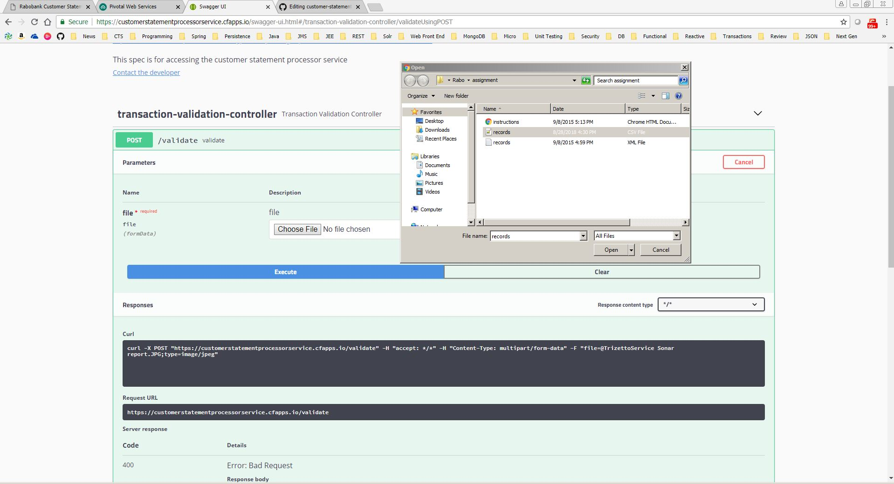

# customer-statement-processor

## Getting Started

### Prerequisites
Clone the CustomerStatementProcessorService Project from the remote git repo (in github) into a local git repo (local machine) and import into Spring Tool Suite (STS).

### Starting the app and using Swagger

1. Starting the boot app via command line
    * Open the command prompt where the CustomerStatementProcessorService project is located.
    * Type ./gradlew bootRun and give enter. You can see the logs stating 'Tomcat started on port(s): 8080 (http)'.
2. Starting the boot app via STS - Use the STS Boot Dashboard to start the Boot app.
3. Launch this url "http://localhost:8080/swagger-ui.html" in any browser.
4. Using Swagger to upload the file as input
    * Click the transaction-validation-controller.
    * Click Try It out button.
    * Click on "Choose File" button and select the file.
    * Click on Execute button.
    * 
5. Sample Success Output
{
  "customerStatementValidationResponse": [
    {
      "transactionReference": "167875",
      "transactionDescription": "Tickets from Erik de Vries"
    },
    {
      "transactionReference": "165102",
      "transactionDescription": "Tickets for Rik Theuß"
    }
  ]
}
6. Sample Error Response
{
  "errorCode": "CSP1001",
  "errorMessage": "Unsupported File format : jpeg"
}

## Authors
* **Rutvij Ravi**
